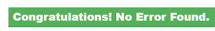

# Rock Paper Scissors Lizard Spock

**Rock Paper Scissors Lizard Spock** is a advanced version of the Rock Paper Scissors game that I have decided to make with HTML, CSS and Javascript. You have 5 choices and 5 rounds to win the game. The game is one player and you must beat the computer to win.

[Play the game here.](https://0netrunner.github.io/RockPaperScissorsLizardSpockPP2/)

# Contents

* [User Experience](#user-experience)

  * [Initial Discussion](#initial-discussion)

  * [User Stories](#user-stories)

* [Design](#design)

  * [Colour Scheme](#colour-scheme)

  * [Imagery](#imagery)

  * [Wireframes](#wireframes)

  * [How to play](#how-to-play)

* [Features](#features)

  * [General features on each page](#general-features-on-each-page)

* [Technologies Used](#technologies-used)

  * [Languages Used](#languages-used)
  
  * [Frameworks, Libraries & Programs Used](#frameworks-libraries--programs-used)

* [Testing](#testing)

  * [Validation](#validation)

  * [Lighthouse](#lighthouse)

  * [Bugs](#bugs)

  * [Existing Bugs](#existing-bugs)

* [Deployment](#deployment)

  * [Local deplyoment](#local-deployment)

* [Credits](#credits)

  * [Code Used](#code-used)

  * [Media](#media)

  * [Acknowledgments](#acknowledgments)

# User Experience

## Initial Discussion

Rock Paper Scissors Lizard Spock is a game I have built that is easy to learn, has a selection of options to choose from to win and is fun to play.

There are 5 rounds and both players display one of the five options to choose from.

The winner of each round is determinded based on each player’s choice, Rock Paper Scissors Lizard and Spock all have rules that dictates who’s choice wins or loses.

## Key information for this site

* An advanced version of the traditional game of Rock, Paper Scissors.

* Two new choices Lizard & Spock.

* A game to play between the user and the computer.

* Learn how to play Rock Paper Scissors Lizard Spock.

## User Stories

* I want the game to load quickly.

* I dont want too much of a challenge.

* I want to see my score go up.

* I want to see if I won.

### Client goals

* To be able to view the game on a range of devices.

* To make it clear how to play the game.

* To have game controls that are easy to read and use.

* To be able to play the game again.

# Design

## Colour Scheme

* **Baby Blue** | **rgb(6, 209, 244)**

  * Background.

  * Button text.

  * Computer choice.

  * Computer win streak.

  * Winner text content when the computer wins.

* **Neon Pink** | **rgb(241. 20, 141)**

  * Header background.

  * Containers background.

  * Button text on hover.
  
* **Black** | **rgb(0, 0, 0)**

  * Header text.

  * Button background colour.

  * Text content.

* **Neon Green** | **rgb(4, 224, 96)**

  * Player choice.

  * Player win streak.

  * Winner text content when the player wins.

* **Yellow** | **rgb(255, 255, 0)**

  * Winner text content on draw.

## Imagery

I have used two images in this game one at the start before playing the game and the second image is after the game ends. I haves also used the second image for the favicon.

* 

* 

## Wireframes

Phone Screens.

* 

* 

* 

Tablet Screens.

* 

* 

* 

Desktop Screens.

* 

* 

* 

# How to play

Both players pick a choice rock beats scissors and crushes lizard, scissors beats lizard by decapitating it, and beats paper by cutting it, paper beats rock by covering it and discredits spock, lizard eats paper and poisons Spock, Spock smashes scissors and vaporizes rock.

# Features

## General features on each page

Introduction

* 

* When the webpage loads you are taken to the introduction which welcomes you to the game and explains how the game works.

* 

* There is a photo of which choice beats the other underneath the welcome message.

* 

* Underneath the image you have a play button to start the game.

* 

Main Game

* After clicking the play button the main game window pops up it shows the player & computers choice.

* 

* 

* Underneath the player & computer choice it shows the winner of the round.

* 

* Then you have five buttons to choose from while you play the game.

* 

* At the bottom of the game container you have win streaks to see who is winning the game.

* 

* When you hover over one of the buttons the colour changes from blue & black to pink & black.

* The game is colour coded.

  * 

  * Green is the colour for anything related to the player there choice, if they won the round, and the players win streak

  * 

  * Blue is the colour for anything related to the computer its choice, if it won the round, and the computers win streak

  * 

  * Yellow is used on the round winner outcome if there is a draw.

  * 
  * 

  * If you win or lose the game after 5 rounds a alert will pop up and tell you that you won or lost before taking you to the next window.

  * 

  * If something is wrong with the game a 404 error page displays

 
End Game

* 

* 

* This section is to thank you for playing the game and gives player the option to play again.

* 

* It has an image of the game characters.

* 

* Gives a button to play the game again.

# Technologies Used

## languages used

* HTML
* CSS
* JavaScript

## Frameworks, Libraries & Programs Used

* [Git](https://git-scm.com/) - For version Control.

* [Github](https://github.com/) - Used to save and store the files for the website.

* [Gitpod](https://www.gitpod.io/) - Was used to created my code.

* [Google Dev Tools](https://developer.chrome.com/docs/devtools/) - To troubleshoot and test features, solve issues with responsiveness and styling.

* [AM I Resposnsive?](https://amiresponsive.co.uk/) - Used to show the Website image on a range of devices.

* [Shields](https://shields.io/) - For the shields at the top of the README.

* [Favicon](https://www.favicon-generator.org/) - Used to make a Favicon for the website.

* [Coolors](https://coolors.co/808080-ff0000-ffffff-f5f5f5-000000) - For my colour scheme.

* [Lamba Testing](https://www.lambdatest.com/?fp_ref=ngan15&gclid=Cj0KCQjwocShBhCOARIsAFVYq0i7XM8lENlC8yIrumBcCkS42VLHZfT6Fjc5waFzBGuNk6OCc7kIBFUaAou3EALw_wcB) - Was used for testing resposiveness across various devices.

* [Favicon Generator](https://www.favicon-generator.org/) - Was
 used to make the favicon.

* [HTML Validator](https://validator.w3.org/) - For HTML validation.

* [W3 Jigsaw](https://jigsaw.w3.org/css-validator/) - For CSS validation.

* [JS Hint](https://jshint.com/) - For JavaScript validation.

# Testing

## Manual Testing

I tested through all these with **LambaTesting** to see diferent screen sizes and browsers..
| Browser | Pass/Fail |
| :---| :---|
| Chrome | Pass|
| Fire Fox | Pass|
| Safari | Pass|
| Edge | Pass|
| Opera | Pass|

These are the browsers I tested myself in futher detail
| Feature | Chrome | Edge | FireFox |
| :---| :---| :---| :---|
| Intro container | Pass | Pass | Pass |
| Main game container | Pass | Pass | Pass |
| End game container | Pass | Pass | Pass |
| Header | Pass | Pass | Pass |
| Play Button | Pass | Pass | Pass |
| Player Choice | Pass | Pass | Pass |
| Player Choice - colour | Pass | Pass | Pass |
| Computer Choice - colour | Pass | Pass | Pass |
| Winner | Pass | Pass | Pass |
| Winner - Colour | Pass | Pass | Pass |
| Buttons | Pass | Pass | Pass | | Pass |
| Player win streak | Pass | Pass | Pass |
| Player win streak - colour | Pass | Pass | Pass |
| Computer win streak | Pass | Pass | Pass |
| Computer win streak - colour | Pass | Pass | Pass |
| Play again button | Pass | Pass | Pass |
| 404 Error | Pass | Pass | Pass |

| Player Choice | Computer Choice | Result | Pass/Fail |
| :---| :---| :---| :---|
|Rock | Rock | Draw | Pass|
| Rock|Paper |Paper| Pass|
|Rock| Scissors| Rock| Pass|
|Rock| Lizard| Rock| Pass|
|Rock| Spock| Spock| Pass|
|Paper| Rock| Paper| Pass|
|Paper| Paper| Draw| Pass|
|Paper| Scissors| Scissors| Pass|
|Paper| Lizard| Lizard| Pass|
|Paper| Spock| Paper| Pass|
|Scissors| Rock| Rock| Pass|
|Scissors| Paper| Scissors| Pass|
|Scissors| Scissors |Draw| Pass|
|Scissors| Lizard | Scissors| Pass|
|Scissors| Spock| Draw| Pass|
|Lizard| Rock| Rock| Pass|
|Lizard| Paper |Lizard| Pass|
|Lizard| Scissors |Scissors| Pass|
|Lizard| Lizard |Draw| Pass|
|Lizard| Spock| Lizard| Pass|
|Spock| Rock| Spock| Pass|
|Spock| Paper| Paper| Pass|
|Spock| Scissors|Spock| Pass|
|Spock| Lizard| Lizard| Pass|
|Spock| Spock|Draw| Pass|

### Validation

* I used [HTML Validator](https://validator.w3.org/) for the HTML

  * 

* I used [W3 Jigsaw](https://jigsaw.w3.org/css-validator/) for the CSS

  * 

* I used [JS Hint](https://jshint.com/) for the JavaScript

  * 

### Lighthouse

* Desktop.

* 

* Mobile.

* 

### Wave

* Wave had no errors.

* 

## Bugs

| Bug | Solution |
| :---| :---|
|I used If/else statements for the game logic checkWinner() the game kept giving a draw at random. | I used a Switch statement instead to solve this problem.|
| The winning streak was going up in doubles after playing again. | I was calling playgame() inside newGame() that was causing this issue.
| I had a footer that would not stretch across the page and stayat the bottom. | After two days of trying to sort it I decided to remove the footer. |

## Existing Bugs

I have one rare bug that has pops up sometimes and I was not able to locate it. When you click scissors on your very first go the computer does not pick there choice but after the game works as normal.

# Deployment

## Local Deployment

[Live preview can be found here](https://onetrunner.github.io/RockPaperScissorsLizardSpockPP2/)

### How to Fork

To fork the repository:

1. Log in to Github.
2. Go to the repository for this project, [0NETRUNNER/RockPaperScissorsLizardSpockPP2.](https://github.com/0NETRUNNER/RockPaperScissorsLizardSpockPP2)
3. Click the Fork button in the top right corner.

### How to clone

To clone the repository:

1. Log in to GitHub.
2. Go to the repository for this project, [0NETRUNNER/RockPaperScissorsLizardSpockPP2.](https://github.com/0NETRUNNER/RockPaperScissorsLizardSpockPP2)
3. Click on the code button, select whether you would like to clone with HTTPS, SSH or GitHub CLI and copy the link shown.
4. Open the terminal in your code editor and change the current working directory to the location you want to use for the cloned directory.
5. Type `git clone` into the terminal and then paste the link you copied in step 3. Press enter.

# Credits

## Code Used

Before starting my project I read [7 ways to code Rock Paper Scissors](https://betterprogramming.pub/7-ways-to-code-rock-paper-scissors-in-javascript-4189a5e7e535) when using a `If else statement` for the game logic it was giving too many bugs so I came back to this article to see how else I could do it.

When I was first deciding what to make for project 2 I was watching coding videos on youtube and came across [Bro Code video of Rock Paper Scissors](https://www.youtube.com/watch?v=n1_vHArDBRA&t=305s). I familiarised myself with his code and learnt how to make the function computer turn. I would like to reference/credit this piece of code.

## Media

I got the image in the first container from [The Big Bang Theory Fandom](https://bigbangtheory.fandom.com/wiki/Rock,_Paper,_Scissors,_Lizard,_Spock).

I got the image in the end game container from [Chasing The Frog](http://www.chasingthefrog.com/item/rock-paper-scissors-lizard-spock-t-shirt/).

## Acknowledgments

* I would like to thank my mentor [Rory](https://github.com/Ri-Dearg) for all the help and guidance through out the project.

* I would like to thank the Tutor support system for helping me when I was stuck or unsure.

* I finished [One Months Javascript course](https://onemonth.com/) while building this project and I would like to thank them for having videos that were explained very well and got straight to the point.

* To refresh myself of the basics I used [The Odins Projects Javascript fundamentals](https://www.theodinproject.com/lessons/foundations-fundamentals-part-1) which linked to many [Mdn Docs](https://developer.mozilla.org/en-US/) I would like to thank The Odin project for always having a helpful article or video to advance my studies.
